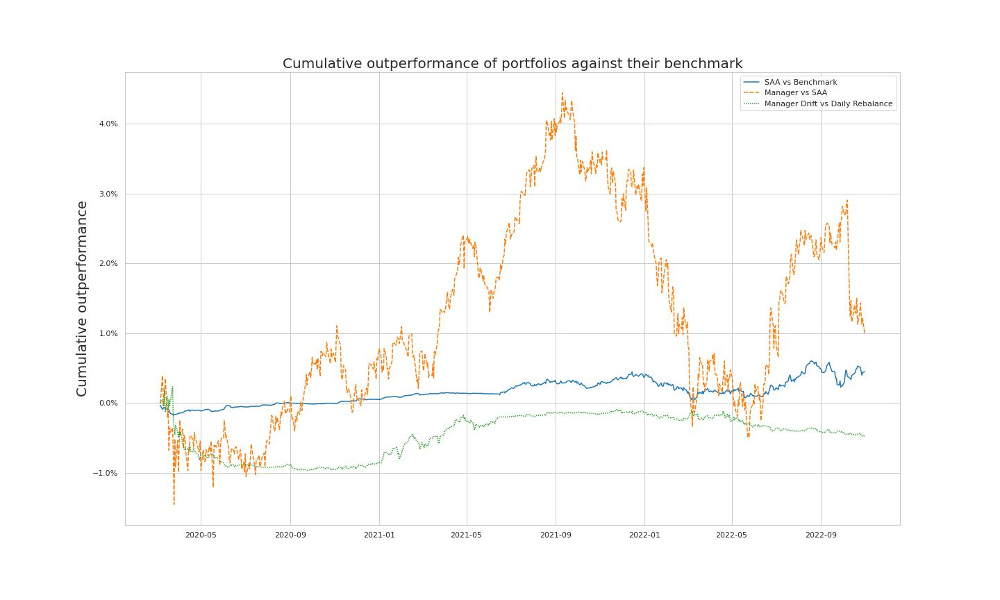

# Portfolio Attribution Analysis



## Overview

This project is designed to conduct a portfolio attribution analysis for a given set of securities. The analysis will consist of three tasks:

1. Generating a portfolio return series
2. Generating a portfolio index series
3. Generating a cumulative outperformance series

## Getting Started

### Prerequisites

In order to run this project, you will need the following software and libraries at minimum, consider using a conda environment to manage dependencies. 

- Python 3
- Pandas
- openpyxl

### Installation

1. Clone this repository to your local machine:

```bash
git clone https://github.com/BooleanJulien/BNC_quant_technical_test.git
```
2. Navigate to the project directory:

```bash
cd BNC_quant_technical_test
```
3. Install packages:
Consider using a conda environment as follows:
```bash
conda create --name portfolio_attribution -y
```

```bash
conda activate portfolio_attribution
```

```
conda install -c anaconda pip -y
```

pip install the necessary packages
```bash
pip install -r requirements.txt
```

### Usage

Before running the analysis, make sure to create the data/ directory with a raw, interim, and processed folder. If you are wanting to contribute, make sure to add this directory to your .gitignore file. You can use the following code in the top level of the repo. 

```bash
mkdir -p data/{raw,interim,processed}
```

Add your copy of `Technical Test - Portfolio Attribution.xlsm` to the data/raw directory.

To run the analysis, navigate to the `src/data` directory and execute the following command:

```bash
python run_all.py
```

If you wish to use a custom date for the indexing, use this format:

```bash
python run_all.py YYYY-MM-DD
```

The results of the analysis will be saved to the `data/processed` directory as three CSV files:

1. `returns.csv`: Contains the portfolio return series.
2. `indexed_performance.csv`: Contains the portfolio index series.
3. `cumulative_outperformance.csv`: Contains the cumulative outperformance series.

## Additional Resources

You may find the notebooks in the [notebooks](notebooks) directory useful for exploratory data analysis, discussion of results, and understanding more of the inner workings of the imputation methodology used to deal with missing data.

You may also wish to view the scripts used in this analysis directly. They are available in [this folder](src/data).

## License

This project is licensed under the MIT License - see the [LICENSE](LICENSE) file for details.

## Acknowledgements

I would like to thank the reviewers for their time and consideration in evaluating this project. Your feedback is greatly appreciated.


<p><small>Project based on the <a target="_blank" href="https://drivendata.github.io/cookiecutter-data-science/">cookiecutter data science project template</a>. #cookiecutterdatascience</small></p>
